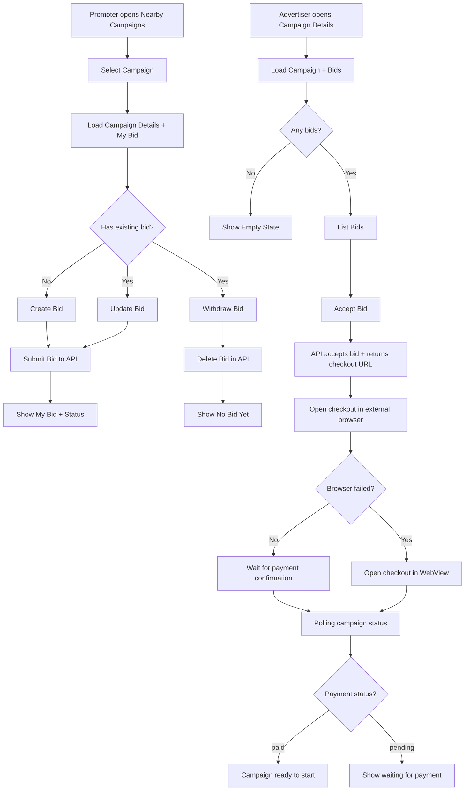

# Campaign Bidding Flow (Mobile)

This document describes the mobile bid flow implemented in the Flutter app, including UI states, data flow, and external payment handling.

## Goals
- Allow multiple promoters to place bids on the same campaign.
- Allow promoters to update or withdraw their bid before acceptance.
- Allow advertiser to accept one bid and trigger payment checkout.
- Prevent starting a campaign until payment is confirmed as `paid`.
- Support external browser checkout with WebView fallback.

## Actors
- Promoter (mobile user)
- Advertiser (mobile user)
- Backend API
- Payment provider (checkout URL)

## High-Level Flow (Mermaid)

## Promoter UI Flow
1. Promoter opens Nearby Campaigns list.
2. Promoter selects a campaign to open details.
3. Details page loads:
   - Campaign data
   - Bid list for the campaign
   - Promoter's existing bid (if any)
4. If no existing bid:
   - Show bid form (price + optional message)
   - Submit creates a new bid
5. If existing bid:
   - Show update form
   - Allow update or withdraw
6. When advertiser accepts a bid:
   - Promoter sees status change (polling)
   - If payment is `paid`, show "Start" action

## Advertiser UI Flow
1. Advertiser opens campaign details.
2. App loads campaign data and bids list.
3. If bids exist, show list ordered by recency.
4. Accepting a bid calls API and returns a checkout URL.
5. App attempts to open checkout in external browser.
6. If external browser cannot be opened, fallback to WebView.
7. App polls campaign payment status and updates UI.

## Data Sources and APIs
### Remote Data Source
- `CampaignBiddingRemoteDataSource` (Dio)
  - `GET /campaigns/{campaignId}/bids`
  - `GET /campaigns/{campaignId}/bids/my`
  - `POST /campaigns/{campaignId}/bids`
  - `PUT /campaigns/{campaignId}/bids/{bidId}`
  - `DELETE /campaigns/{campaignId}/bids/{bidId}`
  - `POST /campaigns/{campaignId}/bids/{bidId}/accept`

### Repository
- `CampaignBiddingRepository`
  - `getBids(campaignId)`
  - `getMyBid(campaignId)`
  - `createBid(campaignId, amount, message)`
  - `updateBid(campaignId, bidId, amount, message)`
  - `withdrawBid(campaignId, bidId)`
  - `acceptBid(campaignId, bidId)`

### Use Cases
- `GetCampaignBidsUseCase`
- `GetMyBidUseCase`
- `CreateBidUseCase`
- `UpdateBidUseCase`
- `WithdrawBidUseCase`
- `AcceptBidUseCase`

### UI Providers
- `biddingProviders` for access to the use cases and repository

## Payment Handling
- Checkout URL returned by `acceptBid`.
- Attempt external browser via `url_launcher`.
- Fallback to in-app WebView when external browser fails.
- UI polls campaign status until `paymentStatus == paid`.

## Notes
- Multiple promoters can bid on the same campaign; only one can be accepted.
- Start campaign is blocked until payment is confirmed as `paid`.
- Polling intervals adjust based on status (open, waiting, ready).
